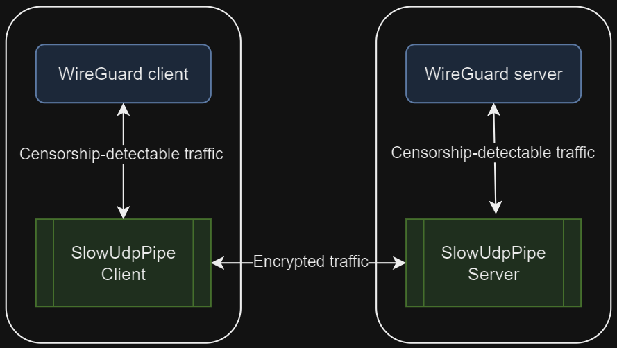
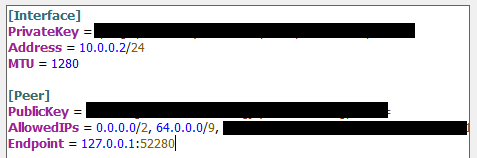

# Slow Udp Pipe
SlowUdpPipe is an application for creating an encrypted UDP tunnel between two computers, with one computer acting as the 'server' and the other as the 'client'. Initially, SlowUdpPipe was designed to bypass WireGuard protocol blocking on Android devices, but it can be used to transmit any UDP traffic. The encrypted packets of SlowUdpPipe do not have any explicit signature and appear to censors as an unrecognized encrypted protocol. Due to this, **SlowUdpPipe is not suitable for use in networks where censorship restricts or blocks unrecognized protocols**.




## Supported Platforms
 - [x] Windows
 - [x] Linux (`x86`, `x64`, `arm`, `arm64`)
 - [x] Android (only client)

There are [releases](https://github.com/casualshammy/slow-udp-pipe/releases) for `windows`, `linux` and `android 9+`. 

## Ciphers
SlowUdpPipe supports the following ciphers: `aes-128`, `aes-256`, `aes-gcm-128`, `aes-gcm-256`, `chacha20-poly1305` and `xor`. They all are safe (except `xor`, but `xor` is extremely fast and usually enough for obfuscating traffic). Some cyphers are not available on all platforms, please use `test` command to get additional info. 
## Key
Key is used to encrypt data. Key **must be the same** on `client` and `server`. `Server` will not respond to packets encrypted with wrong key, so censors will not be able to detect SlowUdpPipe server instance using scanning (but of course server instance will be detectable while serving traffic for clients).

# Quick start for WireGuard
### Server
1. Run `slowudppipeserver genkey` to generate new key;
2. Create file `config.json` with following content:
```json
{
	"wireguard": {
		"remote": "127.0.0.1:51820",
		"local": "0.0.0.0:1935",
		"key": "<generated-key-from-[1]>"
	}
}
```
3. Run `slowudppipeserver -c config.json`;
### Client
4. Change wireguard client's `Endpoint` to `127.0.0.1:52280` (or any other you prefer);
5. Change wireguard client's `MTU` to `1280`;
6. Adjust `AllowedIPs` so traffic to `<server-ip>` will not be routed via wireguard (you can use [this tool](https://www.procustodibus.com/blog/2021/03/wireguard-allowedips-calculator/)); 

7. Create file `config.json` with following content:
```json
{
	"wireguard": {
		"remote": "<server-ip>:1935",
		"local": "127.0.0.1:52280",
		"key": "<generated-key-from-[1]>"
	}
}
```
8. Run `slowudppipeclient -c config.json`

# Command line arguments
There are 2 useful command line commands:
  - `test` : run benchmark of cryptographic algorithms
  - `genkey` : generate new random key
# Config files
SlowUdpPipe use config files to describe endpoints. You can add `rules` as you want, for example, you can add rules for obfuscating `wireguard` and `openvpn` traffic simultaneously.
### Server config file format
```json
{
	"<rule-name (any)>": {
		"remote": "<address of service awaiting for unencrypted traffic (WireGuard, OpenVPN, etc)>",
		"local": "<SlowUdpPipe will listen to this address>",
		"key": "<key for encryption/decryption>"
		"ciphers": ["<optional array of accepted ciphers, see details below>"]
	}
}
```
### Client config file format
```json
{
	"<rule-name (any)>": {
		"remote": "<address of SlowUdpPipe server>",
		"local": "<SlowUdpPipe will listen to this address for traffic (WireGuard, OpenVPN, etc)>",
		"key": "<key for encryption/decryption>"
		"cipher": "<optional name of cipher, see details below>"
	}
}
```

# Why 'Slow'
Because the performance of SlowUdpPipe is insufficient to provide an transfer speed of 1Gbps on cheap VPS. But it is fast enought to provide an transfer speed of 100Mbps on 6$ DigitalOcean droplet.
