# Cloak Tunnel
- [About](#about)
- [Supported Platforms](#supported-platforms)
- [Quick start](#quick-start)
   - [Wireguard setup](#wireguard-setup)
- [Configuration](#configuration)
- [FAQ](#faq)
   - [Websocket or UDP?](#websocket-or-udp)
   - [What encryption to choose?](#what-encryption-to-choose)
   - [Passkey? What is it?](#passkey-what-is-it)

## About
CloakTunnel is a client-server application for creating an encrypted UDP/Websocket tunnel over insecure, firewall-protected, or censored networks. Initially, CloakTunnel was designed to bypass WireGuard/OpenVPN protocol blocking on Android devices, but it can be used to transmit any UDP traffic. The encrypted packets of CloakTunnel do not have any explicit signature and appear to censors as an unrecognized encrypted protocol (or as HTTP/HTTPS traffic if you are using the Websocket transport).

```mermaid
flowchart TD
    desktop[🖥 CloakTunnel client]
    mobile[📱 CloakTunnel client]
    server[💡 CloakTunnel Server]
    UDPservice["📡 UDP service 
    (WireGuard, OpenVPN, etc.)"]
    censor{"🎪 Censorshipped Internet
    or strict firewall"}

    desktop <--> | 🔐 Encrypted traffic | censor <--> | 🔐 Encrypted traffic | server <--> UDPservice
    mobile <--> | 🔐 Encrypted traffic | censor

    style desktop color:#000000, fill:#27C700
    style mobile color:#000000, fill:#27C700
    style server color:#000000, fill:#27C700
    style censor color:#000000, fill:#FFAB58
    style UDPservice color:#000000, fill:#56F0E4
```

## Supported Platforms
 - [x] Windows
 - [x] Linux (`x86`, `x64`, `arm`, `arm64`)
 - [x] Android (client only)

There are [releases](https://github.com/casualshammy/CloakTunnel/releases) for `Windows`, `Linux`, and `Android 9+`. CloakTunnel is also available as an open beta on Google Play:

## Quick start
First, [select](#websocket-or-udp) the transport: UDP or Websocket.

Then, on client side:
1. Run `cloaktunnel-client genkey` to generate a random passkey;
2. Depending on whether you chose UDP or Websocket, do the following:
   - UDP: run `cloaktunnel-client -b udp://127.0.0.1:51820 -f udp://YOUR_CLOAK_TUNNEL_SERVER_IP:1935 -p YOUR_PASSKEY`
   - Websocket: run `cloaktunnel-client -b udp://127.0.0.1:51820 -f ws://YOUR_CLOAK_TUNNEL_SERVER_IP:80/ws-endpoint -p YOUR_PASSKEY`

On server side, depending on whether you chose UDP or Websocket, do the following:
- UDP: run `cloaktunnel-server -b udp://0.0.0.0:1935 -f udp://127.0.0.1:51820 -p YOUR_PASSKEY`
- Websocket: run `cloaktunnel-server -b ws://0.0.0.0:80/ws-endpoint -f udp://127.0.0.1:51820 -p YOUR_PASSKEY`

That's it! Now, connecting to the UDP address `127.0.0.1:51820` on your client machine will connect you to the service running on address `127.0.0.1:51820` on the server.

### Wireguard setup
1. Change the WireGuard client's `Endpoint` to `127.0.0.1:51820`
2. Change the WireGuard client's `MTU` to `1280`;
3. Adjust `AllowedIPs` so that traffic to your CloakTunnel server's IP is not routed via WireGuard (use [this tool](https://www.procustodibus.com/blog/2021/03/wireguard-allowedips-calculator/));

## Configuration
CloakTunnel is configured via command-line options or environment variables.
- `-b`: This parameter defines the listening endpoint of CloakTunnel. You can use `CLOAK_TUNNEL_BIND` environment variable to set this parameter.
- `-f`: This parameter defines where to forward the traffic from the listening endpoint. You can use `CLOAK_TUNNEL_FORWARD` environment variable to set this parameter.
- `-p`: This parameter defines the [passkey](#passkey-what-is-it). You can use `CLOAK_TUNNEL_PASSKEY` environment variable to set this parameter.
- `-c`: This parameter defines the [encryption algorithm](#what-encryption-to-choose). The default is `aes-gcm-obfs-256`. You can use `CLOAK_TUNNEL_CIPHER` environment variable to set this parameter.

There are also two utility commands:
- `test`: Run a benchmark of encryption algorithms.
- `genkey`: Generate a new random key.

## FAQ
### Websocket or UDP?
UDP transport is fast because it encapsulates UDP packets within UDP packets. However, some firewalls block UDP protocols, and in some countries, unknown UDP traffic is blocked by censorship. In such cases, WebSocket is a better option: it looks like HTTP/HTTPS traffic. However, WebSocket is slower because it encapsulates UDP packets within a TCP connection, so the connection speed will not exceed ~40 Mbps.

### What encryption to choose?
CloakTunnel supports the following ciphers: `aes-gcm-128`, `aes-gcm-256`, `aes-gcm-obfs-128`, `aes-gcm-obfs-256`, `chacha20-poly1305` and `xor`. `obfs` means 'obfuscated' and is useful for bypassing filters that block UDP traffic on packet sizes signatures. Some cyphers are not available on all platforms; please use the `test` command for additional information.

### Passkey? What is it?
The passkey is used to encrypt data. The passkey **must be the same** on the `client` and `server`. The `server` will not respond to packets encrypted with the wrong key, so censors will not be able to detect CloakTunnel server instance through port scanning (though, of course, the server instance will be detectable while serving traffic for clients).
